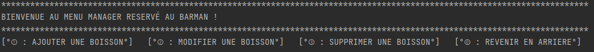

# Bar à Cocktail - JAVA #Equipe1GMI1

### ⚙ Comment l'executer ?

Ouvrir votre console cmd en administrateur.
Puis tapper cd C:/repertoire du programme
java -jar PROJETBARFINAL.jar

### • Bienvenue dans le bar

On veut créer un logiciel pour gérer un bar à cocktails.
L’élément de base du bar est une Boisson qui aura un nom, une contenance et un prix. 
- Certaines boissons sont alcoolisées (BoissonAlcoolisee) et auront en plus un degré
d’alcool.
- Les boissons non alcoolisées (BoissonNonAlcoolisee) auront un degré de sucre et non
d’alcool.

### • Creer son cocktail

Pour créer son cocktail il suffit de suivre le menu intégré au programme.
Lors de la selection des boissons, le cocktail recoit 5ml de chaque boisson, c'est
ainsi que la contenance d'une boisson est calculée.
Le prix du cocktail se calcule à partir des boissons qui le compose.
On multiplie par 1.1 le prix de chaque boisson, puis on additionne les prix de chaque boisson.

### • Gestion du bar

La gestion du bar se fait uniquement en passant par le menu BARMAN MANAGER.
Il permet notamment de modifier le prix, le nom ou bien la quantité d'une boisson.

ATTENTION : la contenance d'une boisson reste fixe à savoir 5ml pour éviter les corruptions avec
la création des cocktails.

### 📸 Screenshots 

### 👨🏾‍💻👨🏼‍💻 Auteurs
[CEM HALIGUR]

[DJENAOUI SELENA]

[BENLAIFAOUI RAYANE]

[BONACORSI JOSHUA]
